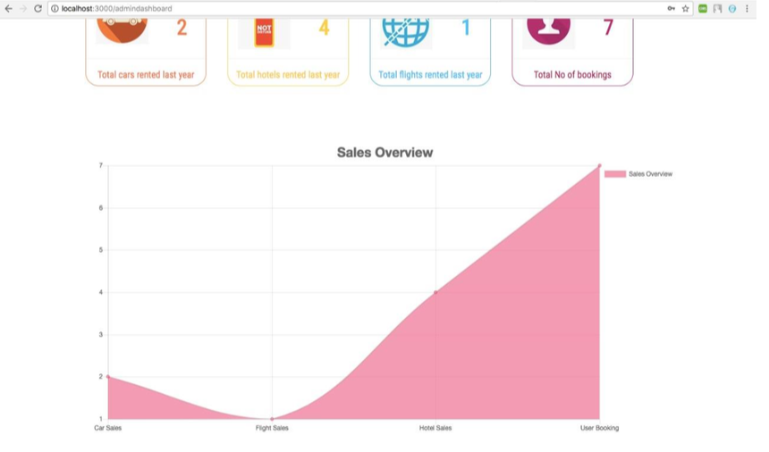
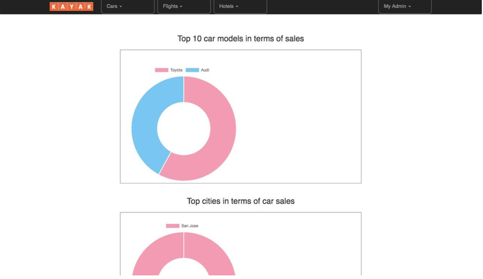

# Kayak_Prototype

Kayak Prototype using technologies:

• Frontend: ReactJs, Redux  
• Backend:  node.js  
• Database: MySQL, MongoDB 
• Messaging Queue: Kafka 

Features: 

• Login  
• Register 
• Flight/Car/Hotel Search 
• View Flight/Car/Hotel Options  
• Apply Filters on search 
• Book Flight/Car/Hotel 
• View Bookings 
• Admin Dashboard 
• Add flight/car/hotel by admin 
• Edit flight/car/hotel details by admin 
• See flight/car/hotel billing info 
• View Sales Overview 
• Top 10 flights/cars/hotels based on sales/certain properties 
• User Tracking Graph

Steps to run the application:

Back-end server
	
1. cd kayak_server
2. npm install
3. npm start

Front-end server

1. cd kayak_client
2. npm install
3. npm start
	
Kafka 

1. Run the script topics.sh
2. cd kyak_kafka
3. npm install
4. npm start

Below are some screenshots demonstrating the application:

### Welcome/Flight Search Page

### Hotel Search Page

### Car Search Page

### Sign Up/Sign In

### Hotel Results Page with filters

### Hotel Booking Page

### Flight Results Page with filters

### Flight Booking Page

### Car Results Page with filters

### Car Booking Page

### Edit User Profile

### Manage Bookings

### Add Car/Flight/Hotel

### See Car/Flight/Hotel Billing Info

### Admin Dashboard

### Graphs based on perperties

