# Kayak_Prototype

Kayak Prototype using technologies:

• Frontend: ReactJs, Redux  
• Backend:  node.js  
• Database: MySQL, MongoDB 
• Messaging Queue: Kafka 

Features: 

• Login  
• Register 
• Flight/Car/Hotel Search 
• View Flight/Car/Hotel Options  
• Apply Filters on search 
• Book Flight/Car/Hotel 
• View Bookings 
• Admin Dashboard 
• View Sales Overview 
• Top 10 flights/cars/hotels based on sales/certain properties 
• User Tracking Graph

Steps to run the application:

Back-end server
	
1. cd kayak_server
2. npm install
3. npm start

Front-end server

1. cd kayak_client
2. npm install
3. npm start
	
Kafka 

1. Run the script topics.sh
2. cd kyak_kafka
3. npm install
4. npm start

Below are some screenshots demonstrating the application:

### Login Page
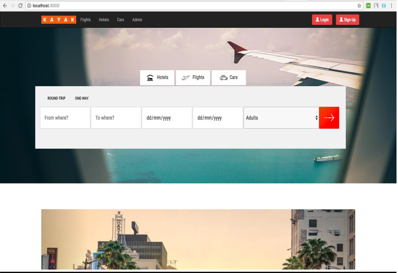

### Register Page
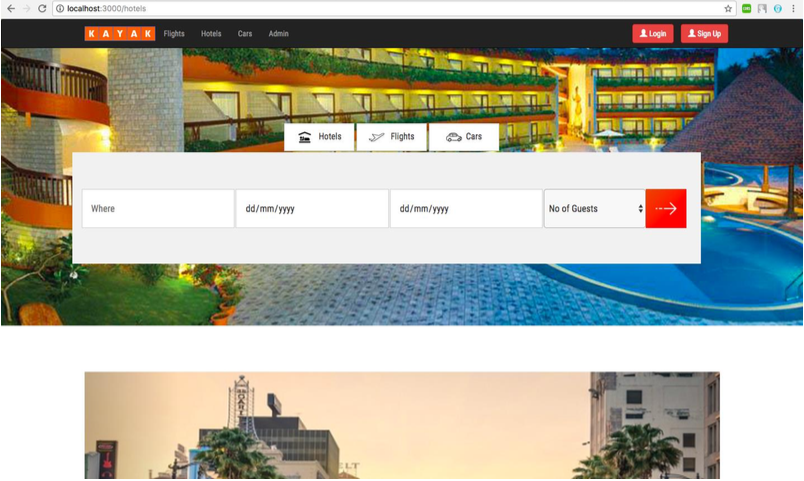

### Welcome Page
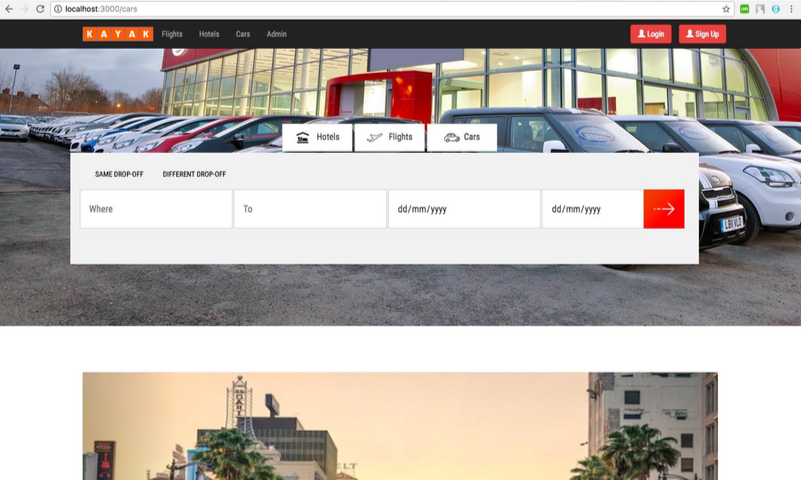

### Upload file
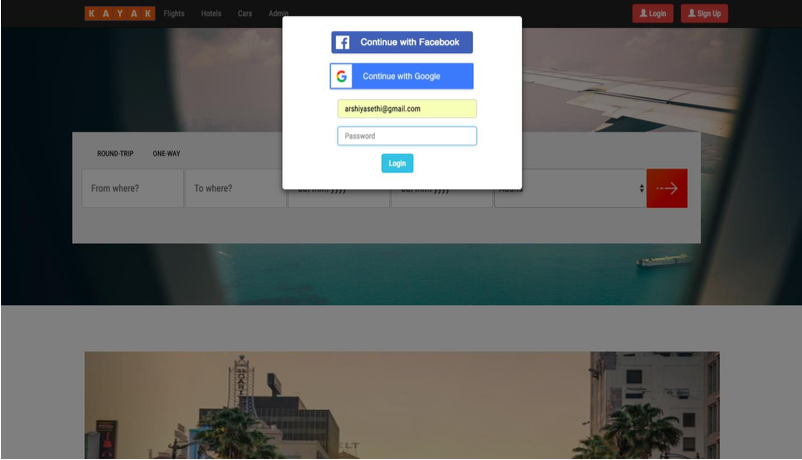

### Create directory
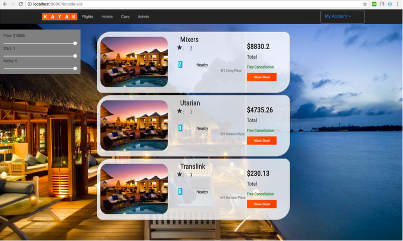

### List files/directories
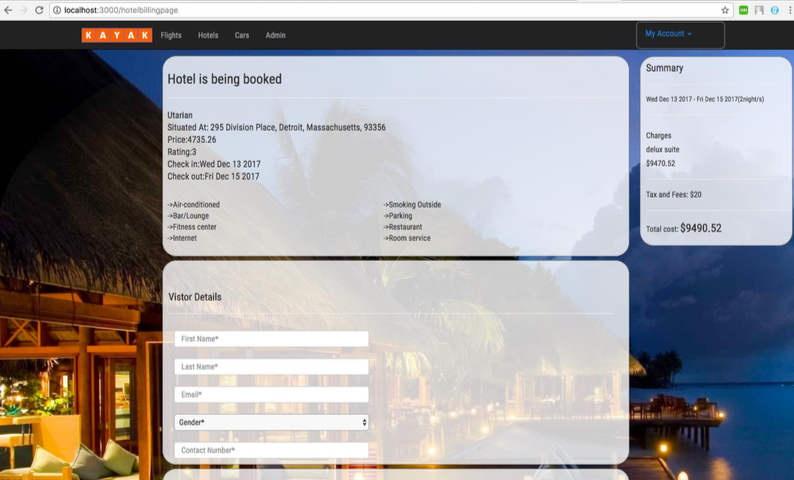

### Star file/directory
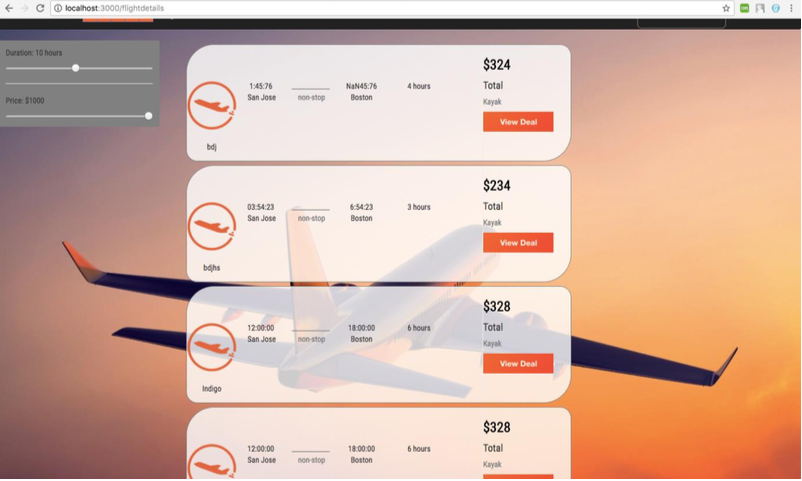

### Remove file/directory
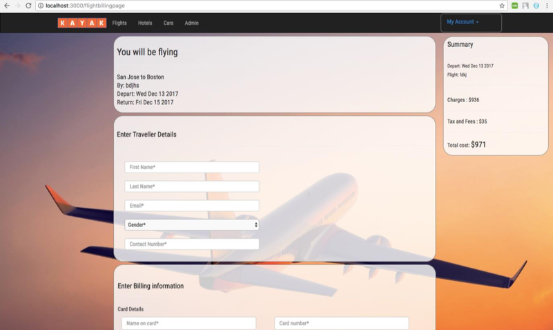

### See Personal Info
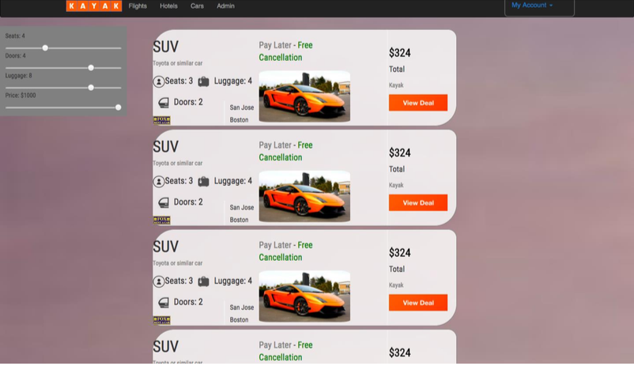

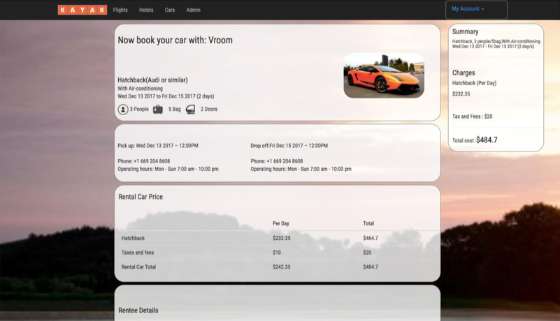

### Edit Personal Info
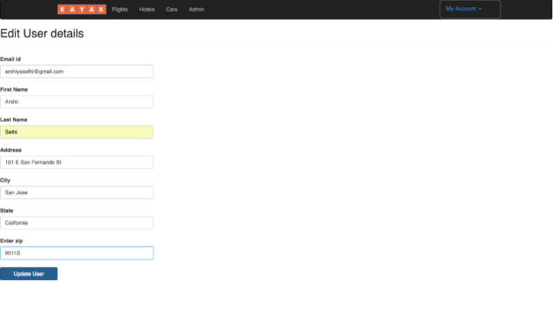

### Share file/directory
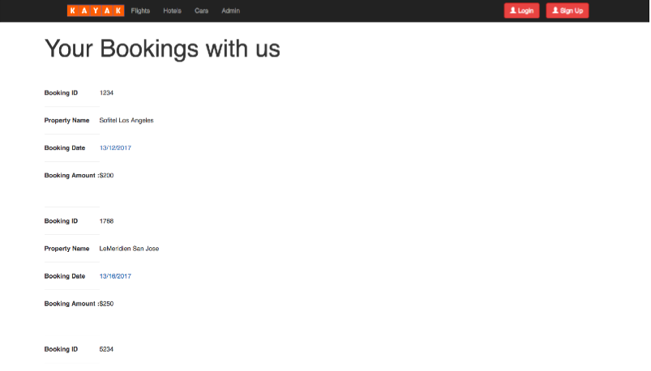

### List shared files
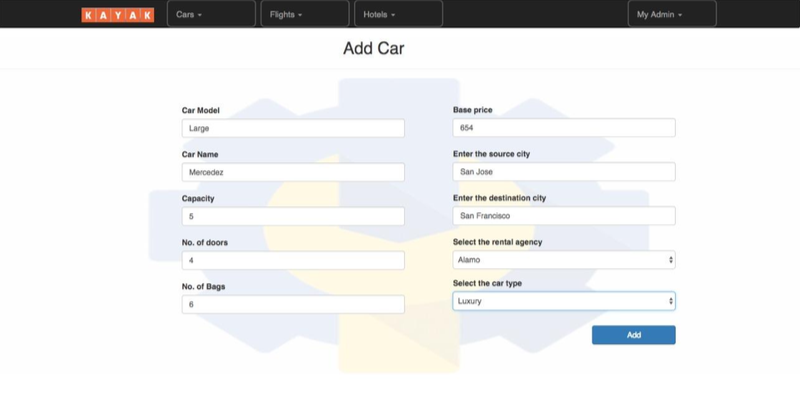

### See activity logs
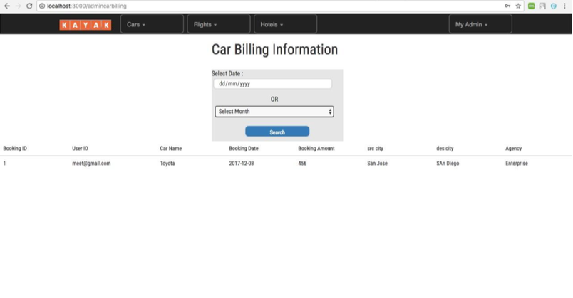

